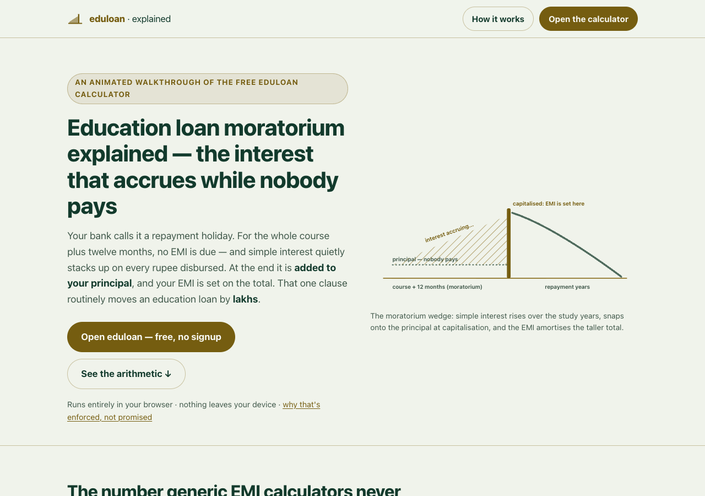

# eduloan · explained

**The education-loan moratorium, explained** — an animated, single-page walkthrough of
how interest accrues while nobody pays, why it is capitalised into your EMI, and how
the free [eduloan calculator](https://sreenivas-sadhu-prabhakara.github.io/eduloan/)
compares the three ways out to the paisa.

**Live:** https://sreenivas-sadhu-prabhakara.github.io/eduloan-explained/
**The calculator it explains:** https://sreenivas-sadhu-prabhakara.github.io/eduloan/



## Why

Generic EMI calculators price an education loan as if repayment starts tomorrow. It
doesn't. Under the IBA Model Education Loan Scheme, repayment starts after the course
period plus 12 months, simple interest accrues the whole time, and at repayment start
it is **added to your principal** — your EMI is set on the total. On a worked ₹10-lakh
loan at 10% that clause is worth ₹5,00,000 of silent accrual, and the choice of paying
nothing vs interest vs a little during study moves the total outflow by **lakhs**.
This page animates that story; the calculator computes it for your own loan.

## What's on the page

- **The hook** — the moratorium wedge, animated: interest rising over the study years,
  snapping onto the principal at capitalisation, then the EMI descent.
- **The problem** — the worked ₹10,00,000 / 10% / 4-year-course example: ₹5,00,000
  accrued, ₹15,00,000 at EMI start, ₹19,822.61 a month instead of ₹13,215.07.
- **The three ways out** — animated balance paths and side-by-side cards for
  A (full moratorium), B (interest served), C (partial ₹3,000/month), with the exact
  savings deltas: ₹2,92,904.15 and ₹1,05,445.79.
- **The engine** — integer paise, closed-form annuity cross-checked against the full
  schedule, IBA/80E/CSIS facts cited verbatim in the calculator's rules panel.
- **The privacy guarantee** — why `connect-src 'none'` makes "your loan never leaves
  this browser" *enforced by the browser*, not promised by a policy page.
- **A feature tour** and a straight CTA to the calculator.

All animation is pure CSS + inline SVG. `prefers-reduced-motion` collapses every
animation to its static, fully-legible final state; the page also renders complete
with JavaScript disabled.

## Quickstart

It's a static page — open `index.html` in any modern browser, or serve the folder:

```sh
python3 -m http.server 8080   # then http://localhost:8080/
```

No build step, no dependencies. Run the self-tests (Node 20+):

```sh
node --test
```

The suite re-derives **every rupee figure displayed on the page** with the same
paise-exact conventions the eduloan calculator uses — closed-form annuity EMI, full
schedule simulation closing at exactly ₹0.00, principal conservation over 400 fuzzed
loans — and then asserts that `index.html` shows exactly those figures, that the CSP
meta is intact, that the H1 stays keyword-first, and that no inline handlers or
network calls exist.

## Privacy — enforced, not promised

This page ships the same `Content-Security-Policy: default-src 'self';
connect-src 'none'` as the calculator: the **browser itself** refuses every outgoing
request. No analytics, no cookies, no CDN, no web fonts, no service worker. There is
nothing to opt out of, because there is no network path to opt out of.

## Disclaimer

This explainer and the eduloan calculator are informational tools, **not financial,
tax, or investment advice**. The worked example assumes a lump-sum disbursement,
simple-interest moratorium accrual per the IBA Model Education Loan Scheme, and one
constant rate for the whole tenor; education loans are floating-rate and banks apply
their own rules — your sanction letter, statements and interest certificate govern.
Scheme facts (IBA moratorium clauses, Section 80E, CSIS) are cited in the
calculator's rules panel with sources, verified on 2026-07-23, and may be amended.
The software is provided "as is", without warranty of any kind; verify every figure
with your bank and a qualified professional before acting.

## License

MIT © 2026 Sreenivas Sadhu Prabhakara — see [LICENSE](LICENSE).
